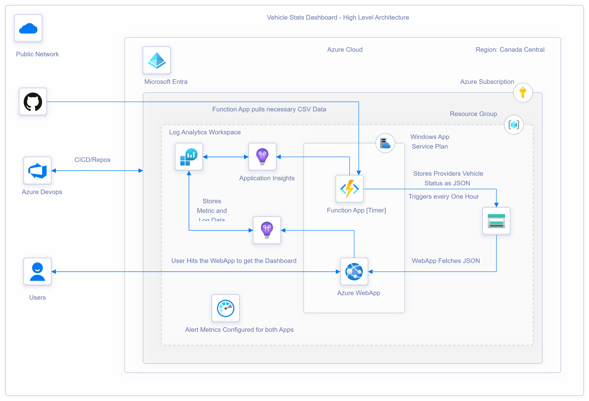
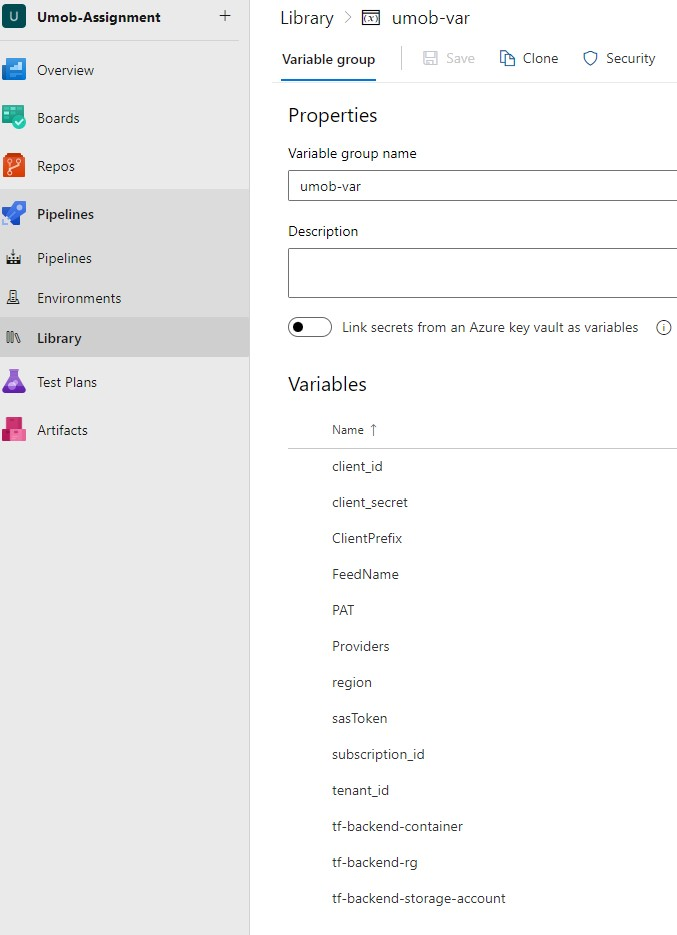
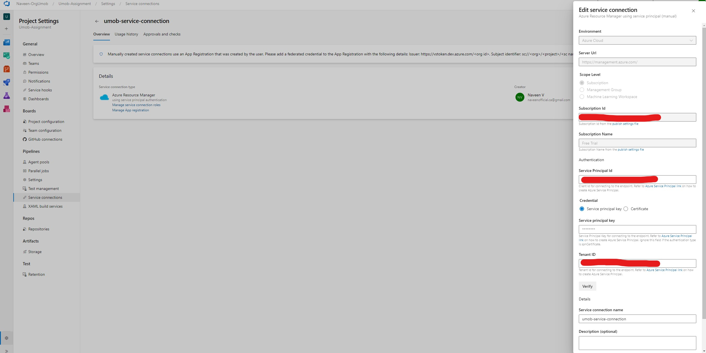

# AutoMonitor
The Vehicle Status Dashboard is a dynamic web application that provides real-time monitoring and management of bike rental services. Designed for bike rental companies and enthusiasts, this dashboard delivers essential insights into bike availability and status.

## Features

- **Real-Time Data:** Automatically fetches vehicle status data from multiple providers.
- **Interactive UI:** Users can select providers and dates to filter vehicle information.
- **Data Storage:** Uses Azure Blob Storage to store JSON data files for efficient access and management.
- **Event-Driven Updates:** Utilizes Azure Functions (written in PowerShell) for scheduled data fetching.

## Architecture

 

## Tech Stack

This project employs a variety of technologies to create a robust and interactive vehicle statistics dashboard:

- **Frontend:**
  - HTML/CSS: Core technologies for structuring and styling the user interface.
  - JavaScript: Used for dynamic functionality and interaction with the Azure Blob Storage API.
  - Azure SDK for JavaScript: Facilitates access to Azure Blob Storage for retrieving vehicle data files.

- **Backend:**
  - Node.js: A JavaScript runtime for building server-side applications.
  - Express: A web application framework for Node.js.
  - PowerShell: Utilized for creating serverless functions that run on a timer trigger. This allows for automated data fetching and processing of vehicle statistics from various providers.

- **Infrastructure as Code:**
  - Terraform: Used for provisioning and managing cloud resources in Azure.

- **Cloud Storage:**
  - Azure Blob Storage: Utilized for storing and retrieving vehicle data files in JSON format, enabling efficient data management and access.

### Data Handling
- **JSON:** The format used for data files stored in Azure Blob Storage, allowing structured and easily consumable data.

### Prerequisites

- [Node.js](https://nodejs.org/) (for local development)
- Azure account with Blob Storage, Azure DevOps, Function App & Web App setup
- [Terraform](https://www.terraform.io/)

### Azure DevOps Configuration

Set the following Azure DevOps pipeline variables as prerequisites:
1. **tf-backend-storage-account**
   - Azure Storage Account Name to store the state file
   - Example: `azure_stroageAccount_name`

2. **client_id**
   - The client ID for Azure authentication [Service Principal].
   - Example: `your_client_id`

3. **client_secret**
   - The client secret for Azure authentication [Service Principal].
   - Example: `your_client_secret`

4. **ClientPrefix**
   - A prefix used for naming resources.
   - Example: `myClientPrefix`

5. **FeedName**
   - A prefic used for Appllications.
   - Example: `myFeedName`

6. **Providers**
   - A comma-separated list of provider IDs.
   - Example: `provider_id_1, provider_id_2, provider_id_3`

7. **region**
   - The Azure region where resources are deployed.
   - Example: `eastus`

8. **sasToken**
   - The SAS token for accessing Blob Storage.
   - Example: `your_sas_token`

9. **subscription_id**
   - The Azure subscription ID.
   - Example: `your_subscription_id`

10. **tf-backend-rg**
   - Azure Storage Account - Resource Group Name
   - Example: `azure_stroageAccount_name`

11. **tf-backend-container**
   - Azure Storage Account - Container Name
   - Example: `azure_stroageAccount_containerName`

 

## Azure DevOps Service Connection Configuration

To enable seamless deployment to Azure resources from your Azure DevOps pipelines, you need to configure a service connection. Follow these steps:

### Step 1: Create a Service Connection

#### Option 1: Automatic Configuration

1. **Navigate to Azure DevOps:**
   Go to your Azure DevOps project.

2. **Project Settings:**
   In the lower left corner, click on **Project Settings**.

3. **Service Connections:**
   Under the **Pipelines** section, click on **Service connections**.

4. **New Service Connection:**
   Click on **New service connection** and select **Azure Resource Manager**.

5. **Authentication Method:**
   Choose **Service principal (Manual)** as the authentication method.

6. **Subscription ID:**
   Enter the Subscription ID

7. **Service Principal Id:**
   Enter the Service Principal Client ID

8. **Service principal key:**
   Enter the Service principal Client Secret

7. **Service Connection Name:**
   Enter a name for your service connection (e.g., `AzureServiceConnection`).

8. **Tenant ID:**
   Specify the Tenant ID.

9. **Verify:**
   Click on **Verify** to ensure that the connection is set up correctly.

10. **Save:**
    Click on **Save** to create the service connection.

 

## Creating a New Pipeline with Existing YAML

To create a new Azure DevOps pipeline using an existing YAML file, follow these steps:

### Step 1: Navigate to Pipelines

1. **Go to Azure DevOps:**
   Open your Azure DevOps project in your web browser.

2. **Select Pipelines:**
   In the left-hand menu, click on **Pipelines**.

### Step 2: Create a New Pipeline

1. **New Pipeline:**
   Click on the **New pipeline** button at the top right corner.

2. **Choose a Source:**
   Select the source where your YAML file is located (e.g., Azure Repos Git, GitHub, etc.).

3. **Select Repository:**
   Choose the repository that contains your YAML file.

### Step 3: Configure Your Pipeline

1. **Select YAML file:**
   In the next screen, choose the option to **Existing Azure Pipelines YAML file**.

2. **Specify the YAML Path:**
   Provide the path to your existing YAML file in the repository. For example, if your YAML file is located at `.azure-pipelines/pipeline.yml`, enter that path.

3. **Review Your Pipeline:**
   You will see a preview of your pipeline configuration based on the YAML file.

### Step 4: Save and Run

1. **Save and Run:**
   Click on the **Save and run** button to create and trigger the pipeline. You can also choose to just save it if you want to run it later.

2. **Monitor Your Pipeline:**
   Once the pipeline is created, you can monitor its progress in the **Pipelines** section. Click on the pipeline name to view details, logs, and results.

### Additional Notes

- Ensure that your YAML file is properly configured with all necessary tasks and variables.
- You may need the appropriate permissions to create and run pipelines in your Azure DevOps project.